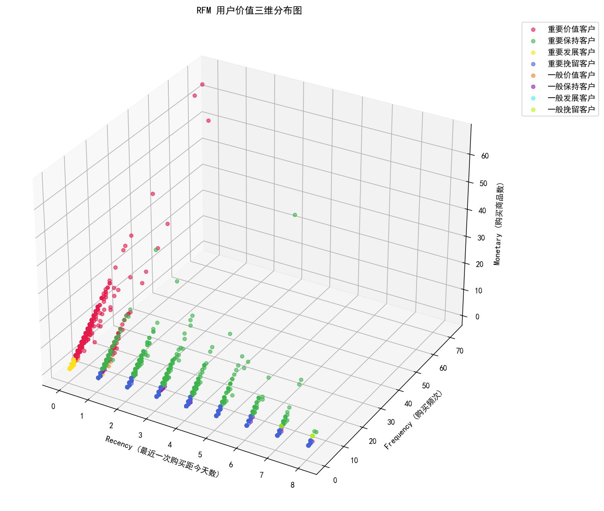
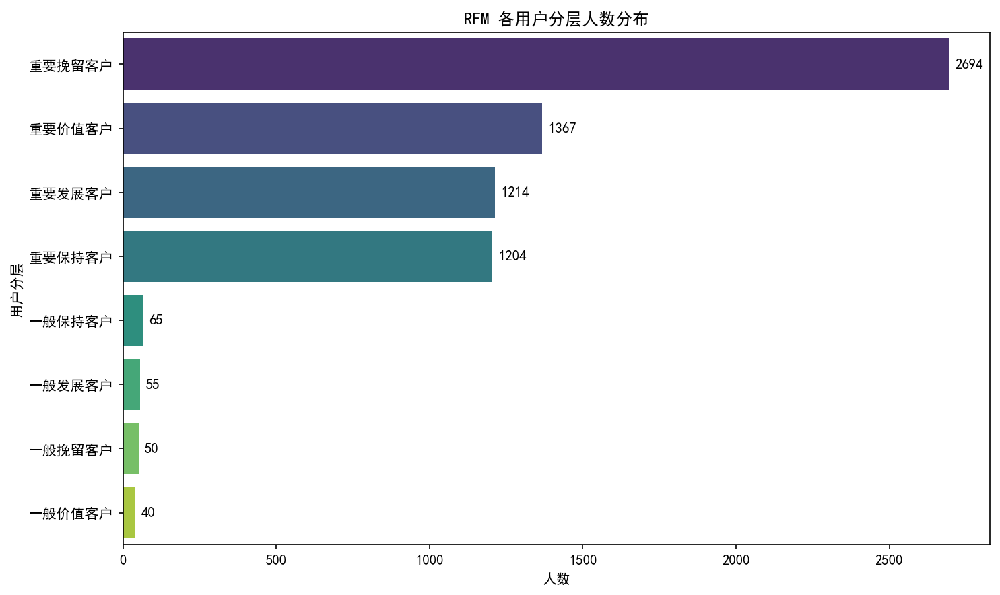

\# 淘宝用户行为数据分析 (Taobao User Behavior Analysis)

\## 📋 项目背景

基于阿里天池提供的淘宝用户行为数据集（约100万条样本，时间跨度2017-11-25至2017-12-03），通过构建双口径转化漏斗，定位用户流失环节，并为运营提供精准营销策略。

\## 🛠️ 技术栈

\- \*\*数据处理\*\*：Python (Pandas)、Git Bash

\- \*\*数据库\*\*：MySQL (窗口函数、多表关联、CTE)

\- \*\*数据可视化\*\*：Matplotlib、Seaborn

\- \*\*开发环境\*\*：Jupyter Notebook

\## 📊 核心分析结论 (基于实际数据)

1\. \*\*整体规模\*\*：99.95万条行为记录，9739个独立用户(UV)，近40万个商品。呈现典型的“长尾”结构（平均每个商品仅被浏览2.2次）。

2\. \*\*行为分布\*\*：浏览(pv)占比89.61%，加购(cart)5.55%，收藏(fav)2.81%，购买(buy)仅2.04%。

3\. \*\*双口径漏斗对比\*\*：

&#x20;  - \*\*宽松漏斗（用户级）\*\*：加购率75.45%，购买率91.34%。

&#x20;  - \*\*严格漏斗（商品级）\*\*：加购至购买同商品的转化率仅6.32%，说明单品流失极其严重。

4\. \*\*运营洞察\*\*：识别出\*\*2021名“加购未购买”的高潜用户\*\*，可作为定向发放优惠券和再营销的核心人群。

\## 📈 图表展示

!\[用户行为分布](charts/behavior\_dist.png)

!\[转化漏斗](charts/funnel.png)

!\[双口径对比](charts/dual\_funnel\_compare.png)

\## 📁 文件结构

\- `data/`：数据样本

\- `notebooks/`：数据清洗与可视化代码

\- `sql/`：核心业务查询SQL

\- `charts/`：可视化结果图表

## 🎯 项目二：RFM 用户价值分层与流失预警

### 📋 背景
基于 6689 名有过购买行为的用户，提取最近一次购买时间（R）、购买频次（F）、购买商品丰富度（M），构建 RFM 模型进行价值分层。

### 📊 核心结论
- **分层结果**：识别出“重要挽留客户”占比最高（40.28%，2694人），其次是“重要价值客户”（20.44%，1367人）。
- **业务洞察**：由于数据集仅包含9天短周期数据，40%的“重要挽留客户”并非真正长期流失，而是短期决策停滞。建议进行轻量级推送唤醒。
- **高潜人群**：输出 2694 名“重要挽留客户”的用户名单，直接可作为运营部门在“双十二”等大促节点定向发放短信/优惠券的核心人群包。

### 📈 图表展示

